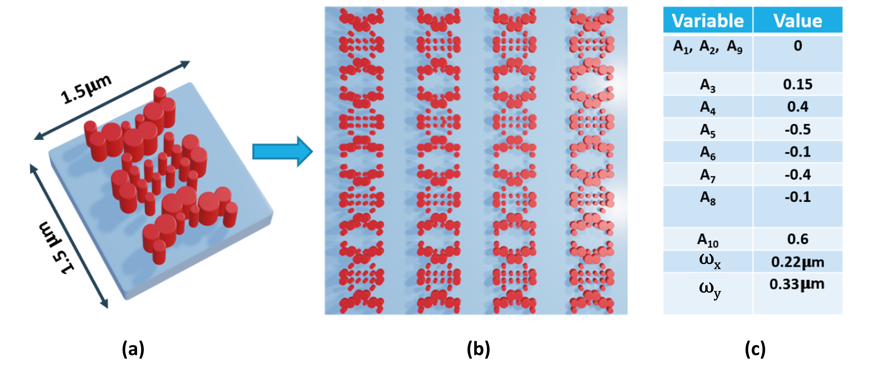
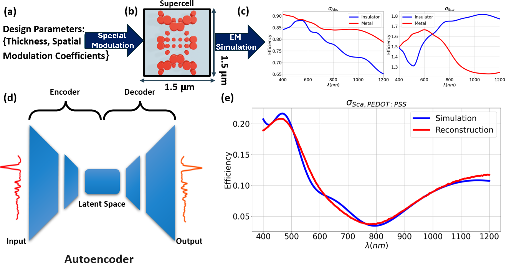
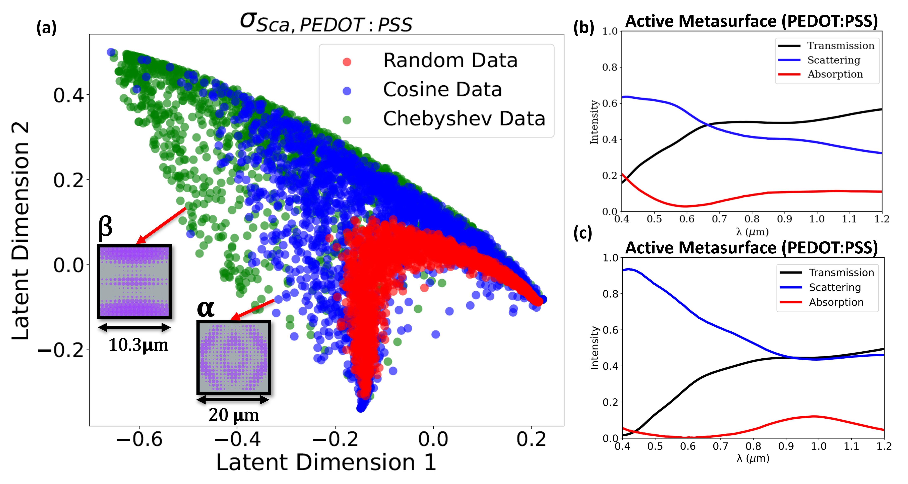
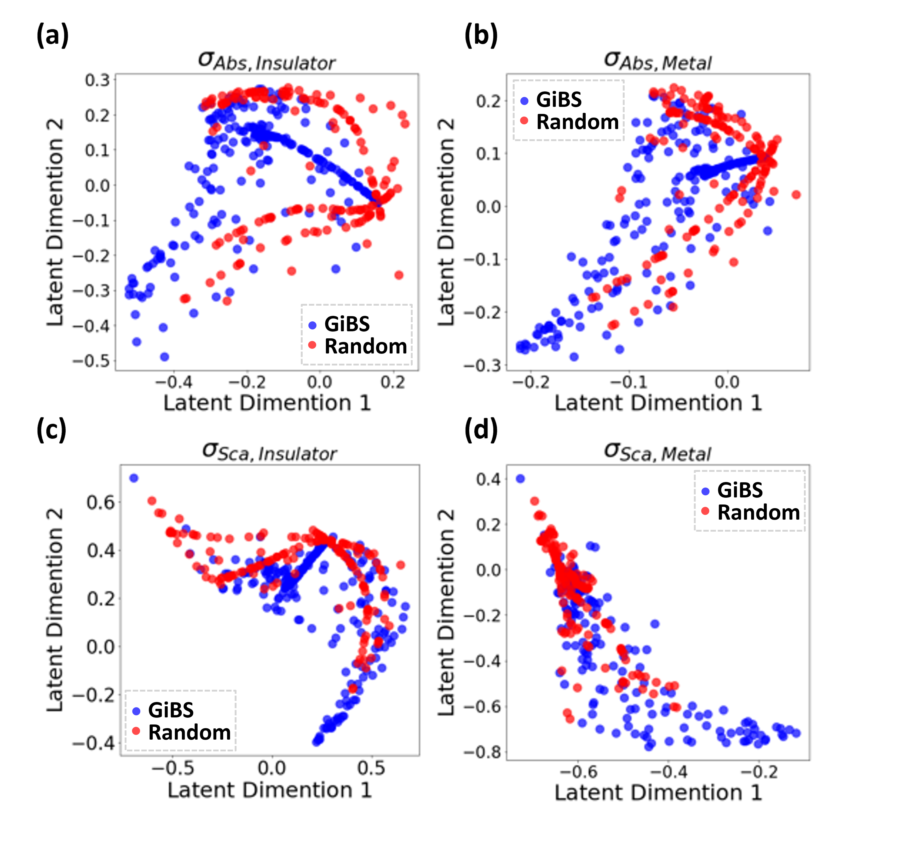

# GiBS — Generative Input-side Basis-driven Structures

**An inverse-design framework for large-scale nonlocal metasurfaces.**

GiBS represents a metasurface supercell as a compact set of coefficients from smooth parametric bases (Fourier or Chebyshev), compressing the design space by more than an order of magnitude. It combines this low-dimensional geometry encoding with an autoencoder-based manifold-learning workflow to map structure–response relationships, enabling rapid exploration and systematic fabrication-sensitivity analysis.

> **Paper:** Marzban, R., Zandi, A., & Adibi, A. (2026). *GiBS: Generative Input-side Basis-driven Structures.*
> arXiv:2511.07339 — [https://arxiv.org/abs/2511.07339](https://arxiv.org/abs/2511.07339)

---

## Key results

| | |
|:---:|:---:|
|  |  |
| **Fig. 1** — A 16×16 pillar supercell fully defined by 12 Fourier basis coefficients. The smooth spatial variation ensures fabrication compatibility while capturing asymmetry for nonlocal interactions. | **Fig. 2** — Autoencoder pipeline: design parameters → FDTD simulation → 201-point spectrum → 2-D latent space → reconstruction. Validation loss converges to ~10⁻⁴. |
|  |  |
| **Fig. 3** — Latent-space embedding of scattering spectra. GiBS structures (Fourier: blue, Chebyshev: green) span a far broader and more continuous manifold than random designs (red), enabling systematic inverse design. | **Fig. 4** — Latent distributions across both insulating and metallic PEDOT:PSS phases. GiBS (blue) consistently broadens and connects the accessible response space compared to random sampling (red). |

---

## Installation

```bash
git clone https://github.com/mr-marzban/GiBS.git
cd GiBS
pip install -r requirements.txt
```

Lumerical FDTD is optional (needed only for actual EM simulation). Point to it via:

```bash
export LUMAPI_PATH="/path/to/Lumerical/api/python/lumapi.py"
```

---

## Quick start

### Fourier-basis supercell

```python
import numpy as np
from src.geometry import build_supercell
from src.visualization import plot_radius_map

# Coefficients from Fig. 1(c) of the paper
coeffs = np.array([0.0, 0.0, 0.0, 0.15, 0.4, -0.5, -0.1, -0.4, -0.1, 0.6, 0.6])

design = build_supercell(
    nx=16, ny=16,
    supercell_period=1.5,        # µm  →  24 µm supercell
    r_base=0.5,
    coeffs=coeffs,
    omega_x=0.22, omega_y=0.33,  # spatial frequencies (µm⁻¹)
    basis="fourier",
    fab_threshold=0.04,          # 80 nm minimum pillar radius
    z_span=0.4,                  # 400 nm PEDOT:PSS film
)
print(f"Active pillars: {design.n_active_pillars} / {design.nx * design.ny}")
plot_radius_map(design.X, design.Y, design.R_fab)
```

### Chebyshev-basis supercell

```python
import numpy as np
from src.geometry import build_supercell

cheb_coeffs = np.array([
    [1.0,  0.3, -0.2],
    [0.4, -0.1,  0.2],
    [-0.3, 0.15, 0.05],
])
design = build_supercell(
    nx=16, ny=16,
    supercell_period=0.6,
    r_base=0.25,
    coeffs=cheb_coeffs,
    basis="chebyshev",
)
```

### Train the spectral autoencoder

```python
from src.dataset import generate_random_dataset
from src.autoencoder import train_autoencoder, encode_spectra

wav, coeffs, spectra = generate_random_dataset(n_designs=1200, seed=42)
model, history = train_autoencoder(spectra, latent_dim=2, epochs=20)
z = encode_spectra(model, spectra)   # shape (1200, 2)
```

### Run the full demo

```bash
python demo.py
```

Runs all four paper figures side-by-side with reproduced GiBS outputs.
Results are saved to `outputs/`.

---

## Lumerical simulation (with licence)

```python
from src.geometry import build_supercell
from src.simulation import LumericalFDTD

design = build_supercell(nx=16, ny=16, supercell_period=1.5,
                         r_base=0.5, coeffs=coeffs)

sim    = LumericalFDTD.connect(state=0)          # state 0 = insulating phase
result = sim.run_single(design, incident_theta=0)

print(result.wavelength)    # µm
print(result.scattering)    # broadband scattering efficiency
sim.close()

# Angle-integrated (Lambertian-weighted) efficiencies
result = sim.run_integrated(design, n_angles=16)
```

---

## Citation

```bibtex
@article{marzban2026gibs,
  title   = {{GiBS}: Generative Input-side Basis-driven Structures},
  author  = {Marzban, Reza and Zandi, Ashkan and Adibi, Ali},
  journal = {arXiv preprint arXiv:2511.07339},
  year    = {2026},
  url     = {https://arxiv.org/abs/2511.07339}
}
```

---

## Contact

- **Author:** Reza Marzban
- **Institution:** School of Electrical and Computer Engineering, Georgia Institute of Technology
- **Email:** mmarzban3@gatech.edu
- **arXiv:** [2511.07339](https://arxiv.org/abs/2511.07339)
